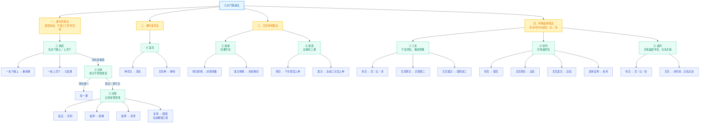
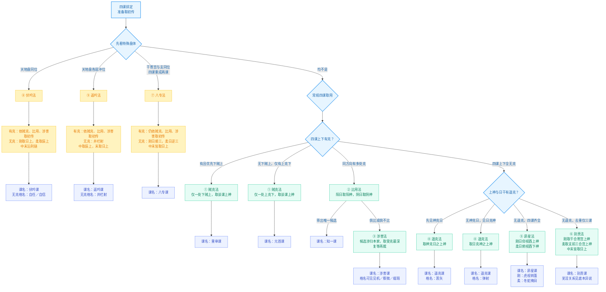

# 九宗门：起课与课名思维导图

> [!important]
> 图中的“宗门”是取初传的方法，“课名”是按该方法成立后的课体名称。贼克一门分出
> 元首、重审两种课名；遥克、昴星、伏吟、返吟另有格名。三传细节仍以各概念卡为准。

## 方法细分分类

### 四类方法

| 方法大类 | 宗门 | 关系 |
| :--- | :--- | :--- |
| 课内克取法 | 贼克 → 比用 → 涉害 | 逐层消歧：先定克向，再筛阴阳，仍不能唯一才涉害 |
| 课外遥克法 | 遥克 | 课内全无克后，比较四课上神与日干 |
| 无克特别取法 | 昴星、别责 | 同为无课内克、无遥克；四课齐全走昴星，去重三课走别责 |
| 特殊盘体取法 | 八专、伏吟、返吟 | 先由盘体识别；有克时可在门内调用贼克、比用、涉害 |

### 各门内部分类

| 宗门 | 一级分支 | 二级课名／格名 |
| :--- | :--- | :--- |
| 贼克 | 下贼上／上克下 | 重审／元首 |
| 比用 | 阴阳筛出唯一／仍不唯一 | 知一／转涉害 |
| 涉害 | 临孟／临仲／临季／复等 | 见机／察微／涉害／缀瑕（当前教程分类） |
| 遥克 | 神克日／日克神 | 蒿矢／弹射 |
| 昴星 | 刚日仰视／柔日俯视 | 虎视转蓬／冬蛇掩目 |
| 别责 | 刚日／柔日 | 干合上神／支前三合宫上神 |
| 八专 | 有克／无克刚日／无克柔日 | 克比涉／顺三／逆三 |
| 伏吟 | 有克／无克刚日／无克柔日／发用自刑 | 取克／自任／自信／杜传 |
| 返吟 | 有克／无克 | 返吟（又名无依）／井栏射（又名无亲） |

> [!warning]
> 《大全》《别责课》先说“别责亦名芜淫”，同篇后面又说“别责虽亦名芜淫，其实芜淫
> 乃另一取”。因此本图不把“芜淫”固定列作别责的无争议别名，只标为明本内部异说。

## 起课路由

## 九宗门对照

| 宗门 | 起课条件 | 初传取法 | 课名／格名 |
| :--- | :--- | :--- | :--- |
| 贼克 | 四课有克 | 有下贼上先取下贼；否则取上克下；均取所选课上神 | 重审／元首 |
| 比用 | 同一克向有多个候选 | 阳日取阳神，阴日取阴神 | 知一 |
| 涉害 | 多候选俱比或俱不比 | 涉归本家取受克最深，复等再裁 | 涉害；见机／察微／缀瑕 |
| 遥克 | 四课上下无克，日干与上神有克 | 先神克日，后日克神；多候选再比用 | 遥克；蒿矢／弹射 |
| 昴星 | 四课齐全，无课内克、无遥克 | 刚日取酉上神；柔日取酉所临地盘神 | 昴星；虎视转蓬／冬蛇掩目 |
| 别责 | 去重仅三课，无课内克、无遥克 | 刚取干合寄宫上神；柔取支前三合宫上神 | 别责；与芜淫关系有明本内部异说 |
| 八专 | 干寄宫与日支同位，四课重成两课 | 有克仍走克比涉；无克刚顺三、柔逆三 | 八专 |
| 伏吟 | 月将加占时，天地盘同位 | 有克走克比涉；无克刚取日上、柔取辰上；中末取刑 | 伏吟；自任／自信／杜传 |
| 返吟 | 天地盘相差六位，各神居冲位 | 有克走克比涉；无克取井栏射 | 返吟（无依）；井栏射（无亲） |

## 证据边界

- 明《六壬大全》第一册《入手法》贼克至返吟九诀，以及第六册《课经一》元首至返吟各课。
- 唐《太白阴经》卷十与十世纪《占事略决》已见大部分取用主干；别责目前最早硬证在
  北宋《景祐六壬神定经》。
- 十世纪《占事略决》的“课用九法”与后世九宗门不是同一份九项清单：它把涉害平局
  裁决另列一法，未列别责。见 [[九宗门之九-北宋结构重组]]。
- 涉害的逐位计重细法目前无宋据；十世纪硬证为直取孟仲季。图中展示当前教程采用的
  《大全》计重口径，不改变证据判断。
- 柔日别责“支前三合”的具体方向见《大全》；北宋官修本只硬证“支合上神”。
- 返吟无克六日与四日、八专和返吟的分流存在文献口径差异，详见 [[返吟法]]。

## 最短路由

> 先判伏吟、返吟、八专；常规盘再依次查：贼克 → 比用 → 涉害 → 遥克 →
> 无遥时四课全则昴星、三课则别责。
